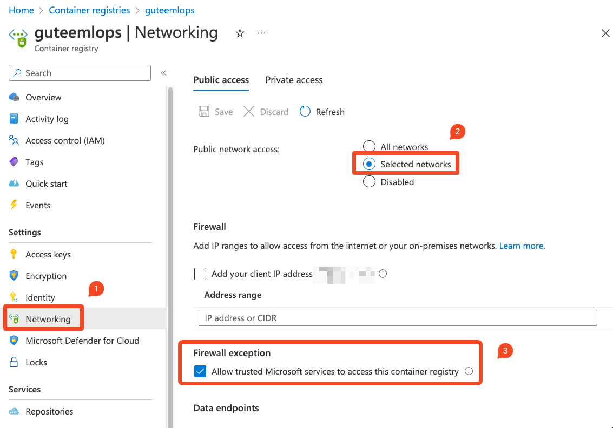
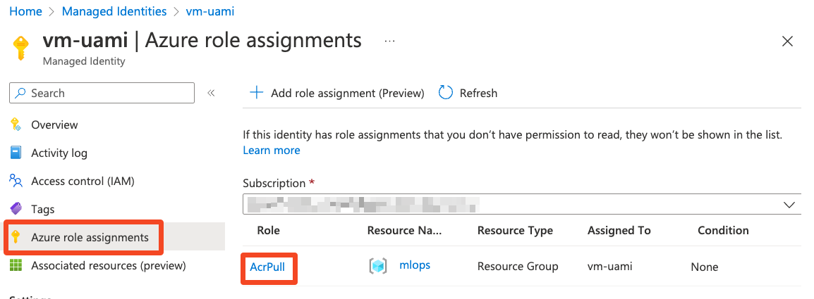
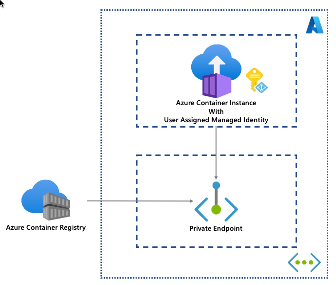

# Azure Management Python SDK for Azure Container Instance
This repository provide sample code to create Azure Container Instance running in Virtual Network, pulling image from Azure Container Registry with private endpoint enabled.This setup also eliminate the needs of admin user of Azure Container Registry. In this case, we will leverage [Azure AD authentication](https://learn.microsoft.com/en-us/azure/container-registry/container-registry-authentication?tabs=azure-cli) capability of Azure Container Registry to authenticate and pull image.

## Azure Setup
### [1] Azure Container Registry
You will need **Premium** sku of Azure Container Registry to setup [Private Endpoint](https://learn.microsoft.com/en-us/azure/container-registry/container-registry-private-link). Under __Networking__, we need to setup private endpoint according to the reference above. Under **Public access**, we need to choose __Selected networks__, and enable "Allow trusted Microsoft services to access this container registry". Refer to this [reference](https://learn.microsoft.com/en-gb/azure/container-registry/allow-access-trusted-services) for more details regarding trusted services.

### [2] User Assigned Managed Identity
This sample leverages user assigned managed identity to authenticate to Azure Container Registry. Create one in Azure portal before hand, and assign **AcrPull** role to this managed identity. This managed identity need not associate to other Azure services.

## High Level Concept
We will leverage Azure Resource Management to perform the deployment. This sample uses service principal to authenticate to Azure Resource Manager to perform deployment. Similar approach can be used for user authentication.

Refer to this [documentation](https://learn.microsoft.com/en-us/azure/container-instances/container-instances-container-groups) to understand the concept of container group within Azure Container Instances.

Firstly, we define the container image(s) for this container group, with respective required resources. Container group is not limited to 1 container image, you can multiple containers, and init container depending on your use cases.

Then, we define the properties of container group. In this case, Azure Container Instances will be deployed in owned [virtual network](https://learn.microsoft.com/en-us/azure/container-instances/container-instances-virtual-network-concepts), hence subnet ID is required. Then, assign the user assigned managed identity to this container group, and specify container registry credential to be this managed identity.

During provisioning, this container group will use this credential and authenticate against Azure Container Registry, and the traffic is going through private endpoint which is being setup.

Full setup as shown below.

